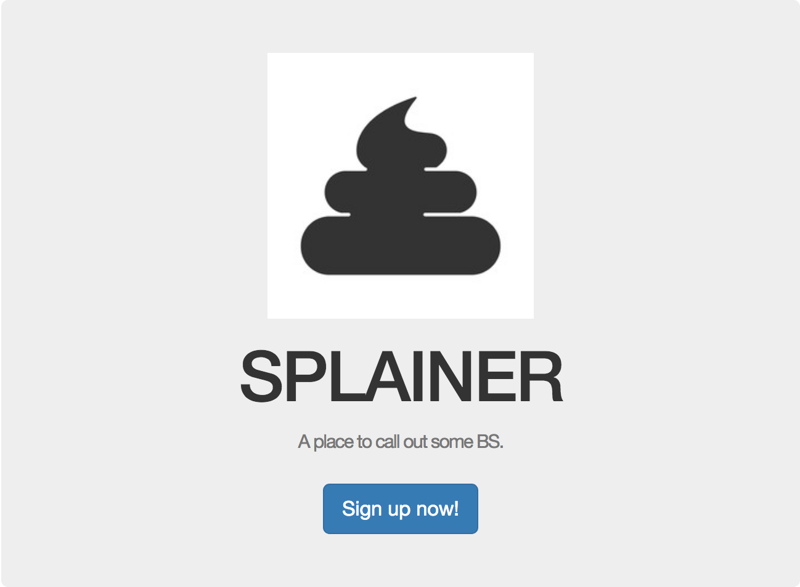
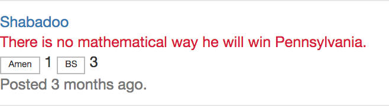

# SPLAINER

SPLAINER is a cynical micro-blogging application in development by Shahin Motia, a student at Flatiron School.

Create a user account, 'Splain something to the community, then either "Amen" or call "BS" on user splains!  

Individual splains with more BS calls than Amens will discolor red, and references to users who have more red splains than black will appear red also!

* Ruby version  
2.3.3

* System dependencies  
Rails 5.1.4  
Bootstrap-sass 3.3.7  
Bcrypt 3.1.11  

* Database creation  
rake db:migrate will create development.sqlite3. There's no seed, so go nuts.

* Maintenance/Contribution  
This repo was more or less a practice run and is not maintained, but that does not diminish the hilarity of this idea or the force of its social criticism.  Please feel free to flesh out any expected functionality!
